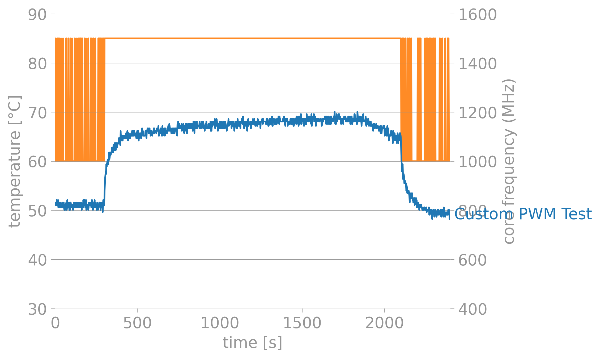

# RPi-Fan-Controller
Automatically set fan's PWM based on CPU Temperature for a Raspberry Pi

## Why I created this script? Why should you use it?
I bought a Raspberry Pi 4 with [official case](https://www.raspberrypi.org/products/raspberry-pi-4-case/) and [offical fan](https://www.raspberrypi.org/products/raspberry-pi-4-case-fan/) and the fan is very noisy.<br>
The RPi is on my desk and this one is next to my bed and it was disturbing.<br>
I am not exaggerating but the RPi official fan is noisier than my Desktop PC with 7 fans in it so I had to do something.

## Setup
1. ### Install requirements
```bash
sudo pip3 install -r requirements.txt 
      or
sudo pip3 install gpiozero
```

2. ### Copy fancontroller.service in /lib/systemd/system/
```bash
sudo cp fancontroller.service /lib/systemd/system/
```

3. ### Enable Service
```bash
sudo systemctl daemon-reload
sudo systemctl enable fancontroller.service
sudo systemctl start fancontroller.service
```

4. ### Check Service
```bash
sudo systemctl status fancontroller.service
```
## How to edit the script?
```TEMPS``` and ```PWM_OUTPUT```: Edit them based on your temperature limit and what PWM you want to use when the CPU Temperature is above the limit you selected previous.<br>
```GPIO_PIN``` : Edit this one based on the GPIO Pin you are using for your fan. The script I think it can be extended with more fans, example below.<br>
```DEFAULT_PWM```: Put the fan PWM value back to default value when you stop the script.<br><br>
Extend script for more fans(I didn't test this one bcs I don't have more fans, so it might be broken):
```bash
fan1 = PWMOutputDevice(GPIO_PIN1)
fan2 = PWMOutputDevice(GPIO_PIN2)
fan3 = PWMOutputDevice(GPIO_PIN3)
fan1.value = 1.0
fan2.value = 0.8
fan3.value = 0.4
```

## Stress test with stressberry 
```bash
sudo apt install stress
sudo pip3 install stressberry
sudo /home/<<USER>>/.local/bin/stressberry-run -n "Custom PWM Test" -d 1800 -i 300 -c 4 test.out
sudo MPLBACKEND=Agg /home/<<USER>>/.local/bin/stressberry-plot test.out -f -d 300 -f -l 400 1600 -t 30 90 -o test.png --not-transparent
```

